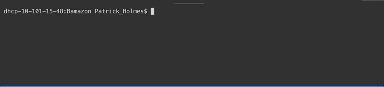
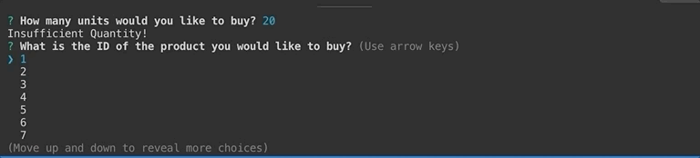

# Bamazon

In this app, the user is a 'customer' and is able to place orders for products displayed in a mySQL database.  The database is prepopulated with 10 products.  When the user runs the app by running the command, **node bamazonCustomer.js**, the product list is shown in the terminal.

After the products are listed, the user is prompted with 2 questions, 1 asking the id of the item they would like to purchase, followed by the amount of inventory they would like to purchase.  If the amount of inventory in the database is less than the order amount they've placed, they will receive a message saying "Insufficent quantity".

If there is enough inventory in the database, they will receive a message saying "Order fulfilled!" followed by the total cost of their purchase.

This will then update the inventory in the database by subtracting the amount that they purchased.